# Судоку
## Оглавление
* [Разновидности судоку](#разновидности-судоку)
  * [Классическое судоку](#классическое-судоку)
    * [Правила](#правила)
    * [Основные методы решения](#основные-методы-решения)
      * [«Последний герой»](#последний-герой)
      * [«Последний герой» в строке](#последний-герой-в-строке)
      * [«Голые» пары](#голые-пары)
      * [«Голые» тройки](#голые-тройки)
  * [Мегасудоку](#мегасудоку)
  * [Судоку «Чет-Нечет плюс»](#судоку-чет-нечет-плюс)
  * [Судоку «Перегородки»](##судоку-перегородки)
  * [Судоку «Куб»](#судоку-куб)
  * [Судоку «Неравенства»](#судоку-неравенства) 
  * [Судоку «Цепочки»](#судоку-цепочки) 
  * [Судоку «Не пара»](#судоку-не-пара) 
  * [Судоку «Пара»](#судоку-пара) 
  * [Судоку «Трио»](#судоку-трио) 
  * [Судоку «Сумма по диагонали»](#судоку-сумма-по-диагонали) 
  * [Судоку «Геометрические»](#судоку-геометрические) 
  * [Судоку «Виндоку»](#судоку-виндоку) 
  * [3D-Судоку или «Тредоку»](#3d-судоку-или-тредоку)
  * [Судоку «Диагональ»](#судоку-диагональ)
  * [Судоку «Римское»](#судоку-римское) 
  * [Судоку «Квадро»](#судоку-квадро) 
  * [Судоку «Точки-2»](#судоку-точки-2) 
  * [Судоку «Суммы сбоку»](#судоку-суммы-сбоку) 
  * [Судоку «Квадросуммы»](#судоку-квадросуммы)
  * [Судоку «Ёлочки»](#судоку-ёлочки)
  * [Судоку «Киллер»](#судоку-киллер)
  * [Термо-судоку](#термо-судоку)
* [Уровни сложности судоку на разных сайтах](#уровни-сложности-судоку-на-разных-сайтах)
* [Наши судоку](#наши-судоку)
  * [Реализованные методы](#реализованные-методы)
* [Структура проекта](#структура-проекта)
## Разновидности судоку
### Классическое судоку

<p  align="center">
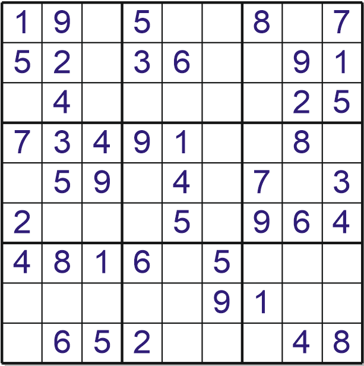
</p>

#### Правила  

Классическое игровое поле судоку представляет собой таблицу 9х9, в которую всего выходит 81 клетка. В каждой клетке может располагаться цифра от 1 до 9. Пустые клетки заполняются так, чтобы в каждой строке, каждом столбце и каждом мини-квадрате 3х3 каждая цифра встречалась только один раз.  

Уровень сложности игрового поля напрямую зависит от количества пустых клеток и от методов, используемых для решения. Чтобы решить самые простые, достаточно внимательно рассмотреть, какая цифра может стоять в выбранной ячейке. Чаще всего для нее существует только один вариант. Паззлы такого вида решаются за буквально за пару минут. На более сложные можно потратить около часа или даже больше.  

Правильно построенное игровое поле может иметь только одно решение. Всего таких судоку размера 9х9 существует 6 670 903 752 021 073 000 000.  

#### Основные методы решения

##### *«Последний герой»*

<p  align="center">
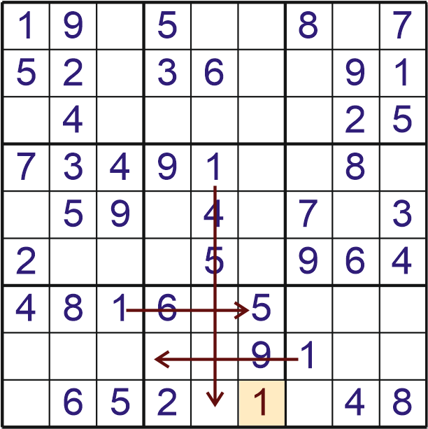
</p>  

Рассмотрев восьмой квадрат, можно заметить, что для единицы существует единственная клетка, для которой нет повторений ни в строке ни в столбце.  

##### *«Последний герой» в строке*

<p  align="center">
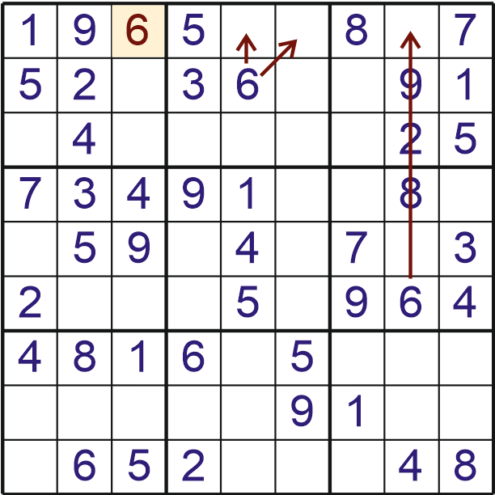
</p>  

Рассмотрев "6" на поле, становится очевидно, что она должна быть где-то в первой строке. Она не может быть во втором квадрате 3х3, так как там уже стоит "6". В третьем квадрате 3х3 единственная свободная клетка для строки тоже не подходит. Последним возможным вариантом становится третья клетка в строке. 

##### «Голые» пары

<p  align="center">
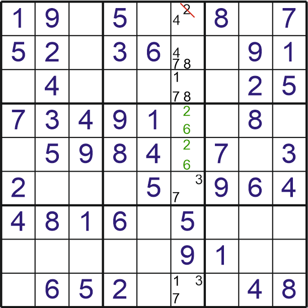
</p>  

Голой парой называют набор из двух пар, принадлежащих одной области(квадрату 3х3, столбцу, строке). Если находится голая пара, цифры, входящие в нее, будут исключены из других клеток рассматриваемой области.
Рассмотрим пятый квадрат 3х3. Голую пару составляют цифры "2" и "6", значит из шестой клетки в первой строке можно вычеркнуть "2". На этом месте верное значение "4".  


##### «Голые» тройки

<p  align="center">
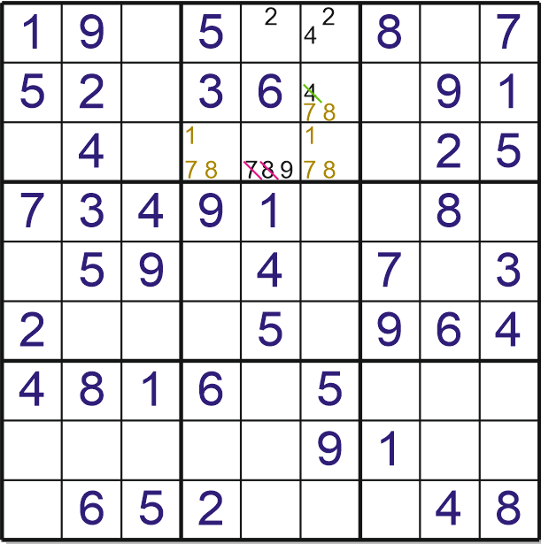
</p>  

Голые тройки — усложненный вариант голых пар.
Голой тройкой будет являться любая группа из трех ячеек в одном блоке, содержащая в общем три схожих кандидата. Когда такая группа нашлась, эти три кандидата могут быть убраны из других ячеек блока.  
Также допускается убрать из ячеек группы цифры, не входящие в группы. У данного подхода есть свое название — метод «скрытых» троек.

Варианты комбинаций для голых троек:  
|         По три   |      По три и два|      По два и три|       По два |
|------------------|------------------|------------------|--------------|
|[abc] [abc] [abc] | [abc] [abc] [ab] | [abc] [ab] [ac]  |[ab] [aс] [bc]|
|                  | [abc] [abc] [aс] | [abc] [ab] [ac]  |              |
|                  | [abc] [abc] [bc] | [abc] [ac] [bc]  |              |


### Мегасудоку  

<p  align="center">
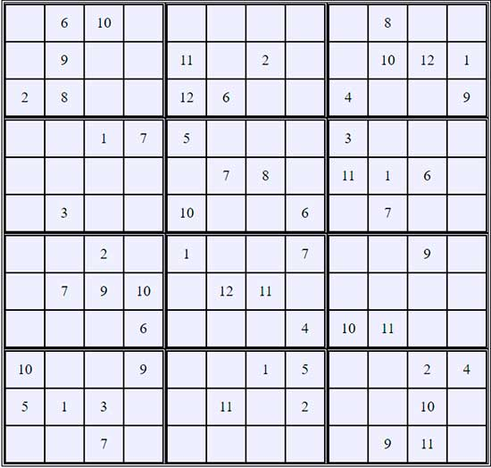
</p>  

Числа от 1 до 12 не должны повторяться по вертикали, горизонтали и в малых квадратах.

### Судоку «Чет-Нечет плюс» 

<p  align="center">
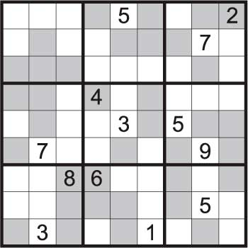
</p>  

Числа от 1 до 9 не должны повторяться по вертикали, горизонтали и в малых квадратах + в выделенных квадратах могут находиться только четные/нечетные цифры.

### Судоку «Перегородки» 

<p  align="center">
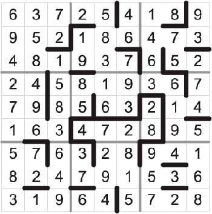
</p>  

Числа от 1 до 9 не должны повторяться по вертикали, горизонтали и в малых квадратах + числа разделенные перегородкой отличаются друг от друга на единицу.

### Судоку «Куб» 

<p  align="center">
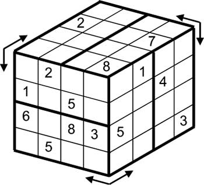
</p>  

Три квадрата 8х8, внутри каждого 2 зоны. Числа от 1 до 8 не должны повторяться по вертикали, горизонтали и в каждой зоне + строки и столбцы перетекают с одной грани куба на другую.

### Судоку «Неравенства» 

<p  align="center">
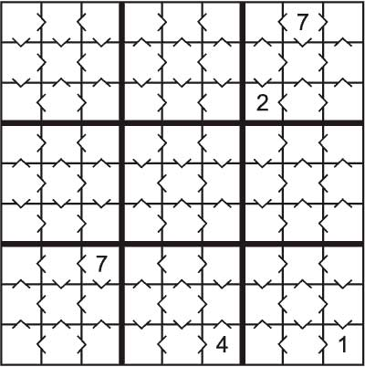
</p>  

Большой квадрат 9×9, малые 3х3. Числа от 1 до 9 не должны повторяться по вертикали, горизонтали и в малых квадратах + должны соблюдаться все знаки неравенства.

### Судоку «Цепочки» 

<p  align="center">
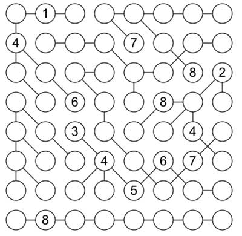
</p>  

Стороны 8х8 или 9х9 кружочков. Числа не должны повторяться по вертикали, горизонтали и в звеньях одной цепочки.

### Судоку «Не пара» 

<p  align="center">
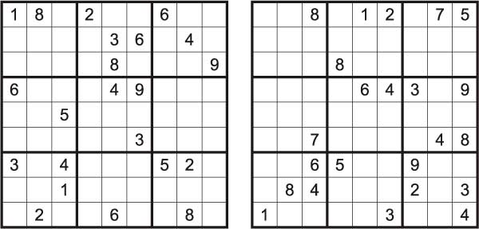
</p>  

Два квадрата 9х9, с малыми квадратами 3х3. Числа от 1 до 9 не должны повторяться по вертикали, горизонтали и в малых квадратах + числа на соответствующих позициях каждого квадрата не должны совпадать.

### Судоку «Пара» 

<p  align="center">
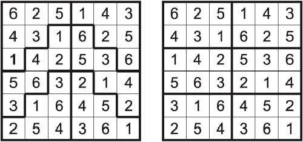
</p>  

Два квадрата 9х9, с малыми квадратами 3х3. Числа от 1 до 9 не должны повторяться по вертикали, горизонтали и в малых квадратах + числа на соответствующих позициях каждого квадрата должны совпадать.

### Судоку «Трио» 

<p  align="center">
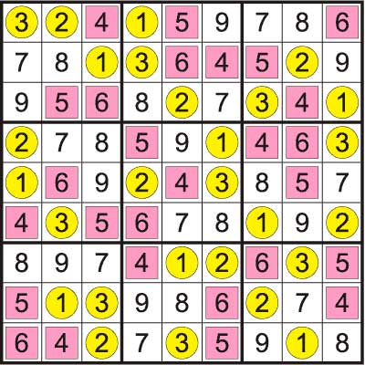
</p> 

Большой квадрат 9×9, малые 3х3. Числа от 1 до 9 не должны повторяться по вертикали, горизонтали и в малых квадратах + в кружках цифры от 1 до 3, в квадратах 4-6, в пустых 7-9.

### Судоку «Сумма по диагонали» 

<p  align="center">
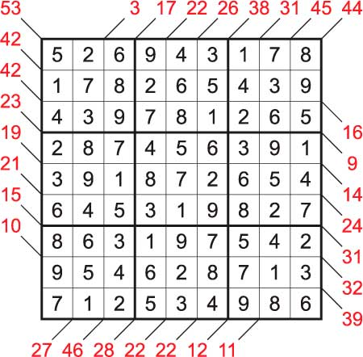
</p> 

Большой квадрат 9×9, малые 3х3. Числа от 1 до 9 не должны повторяться по вертикали, горизонтали и в малых квадратах + цифры вокруг квадрата показывают сумму соответствующей диагонали + повтор чисел по диагонали не запрещен.

### Судоку «Геометрические» 

<p  align="center">
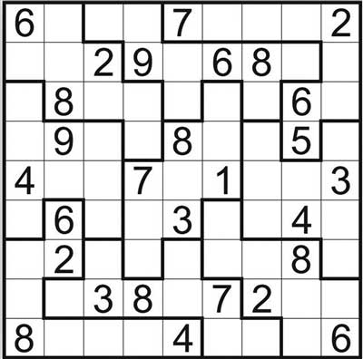
</p> 

Большой квадрат 9×9, геометрические фигуры. Числа от 1 до 9 не должны повторяться по вертикали, горизонтали и внутри выделенных зон.

### Судоку «Виндоку» 

<p  align="center">
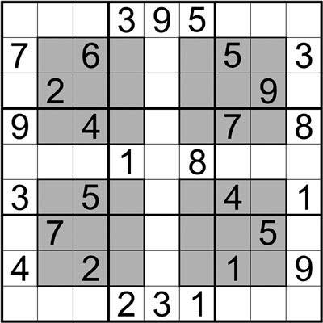
</p> 

Большой квадрат 9×9, малые 3х3 + доп. квадраты 3х3. Числа от 1 до 9 не должны повторяться по вертикали, горизонтали и в малых квадратах + в дополнительных квадратах.

### 3D-Судоку или «Тредоку»

<p  align="center">
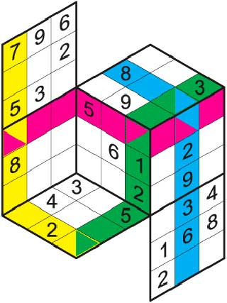
</p> 

Головоломка имеет множество форм. Числа не должны повторяться по вертикали, горизонтали и в малых квадратах + линии перетекают с одной грани на другую.

### Судоку «Диагональ»

<p  align="center">
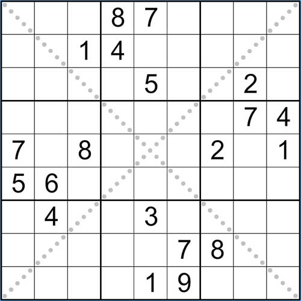
</p> 

Большой квадрат 9×9, малые 3х3. Числа от 1 до 9 не должны повторяться по вертикали, горизонтали и в малых квадратах + по диагоналям.

### Судоку «Римское» 

<p  align="center">
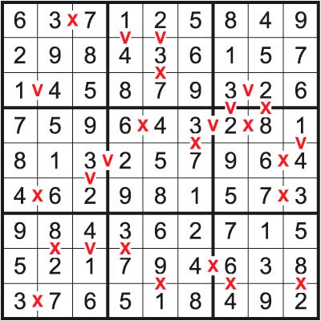
</p> 

Большой квадрат 9×9, малые 3х3. Числа от 1 до 9 не должны повторяться по вертикали, горизонтали и в малых квадратах + между цифрами сумма которых равна 10 ставится X + между цифрами сумма которых равна 5 ставиться V.

### Судоку «Квадро» 

<p  align="center">
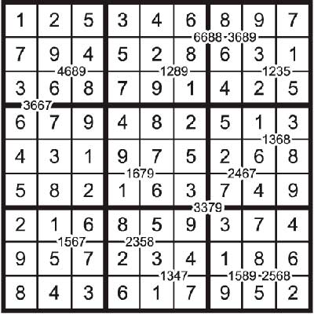
</p> 

Большой квадрат 9×9, малые 3х3. Числа от 1 до 9 не должны повторяться по вертикали, горизонтали и в малых квадратах + цифры на линиях означают числа, которые должны быть использованы в примыкающих клетках (порядок не важен).

### Судоку «Точки-2» 

<p  align="center">
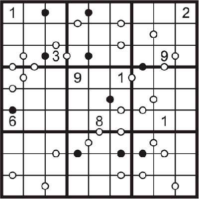
</p> 

Большой квадрат 9×9, малые 3х3. Числа от 1 до 9 не должны повторяться по вертикали, горизонтали и в малых квадратах + если цифры в соседних клетках отличаются на 1 ставиться белая точка, если на 2 черная + между цифрами 1 и 2 точка ставиться произвольно.

### Судоку «Суммы сбоку» 

<p  align="center">
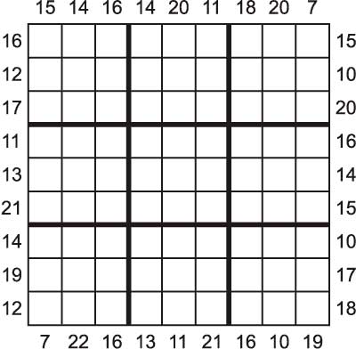
</p> 

Большой квадрат 9×9, малые 3х3. Числа от 1 до 9 не должны повторяться по вертикали, горизонтали и в малых квадратах + сбоку показаны цифры, которые являются суммой трех чисел расположенных по вертикали или горизонтали соответственно.

### Судоку «Квадросуммы»

<p  align="center">
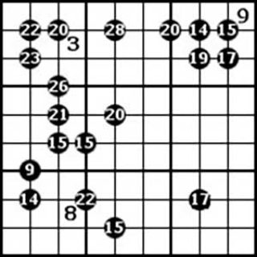
</p> 

Большой квадрат 9×9, малые 3х3. Числа от 1 до 9 не должны повторяться по вертикали, горизонтали и в малых квадратах + числа на линиях равняется сумме чисел в прилегающих клетках.

### Судоку «Ёлочки»

<p  align="center">
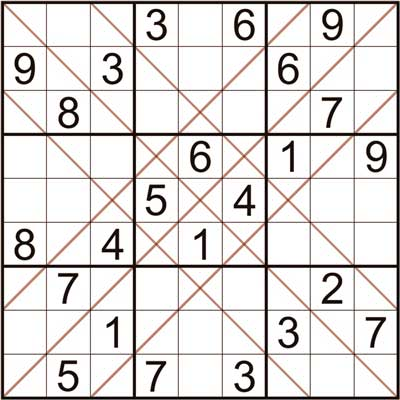
</p> 

Большой квадрат 9×9, малые 3х3. Числа от 1 до 9 не должны повторяться по вертикали, горизонтали и в малых квадратах + на всем протяжении прочерченных линий.

### Судоку «Киллер»

<p  align="center">
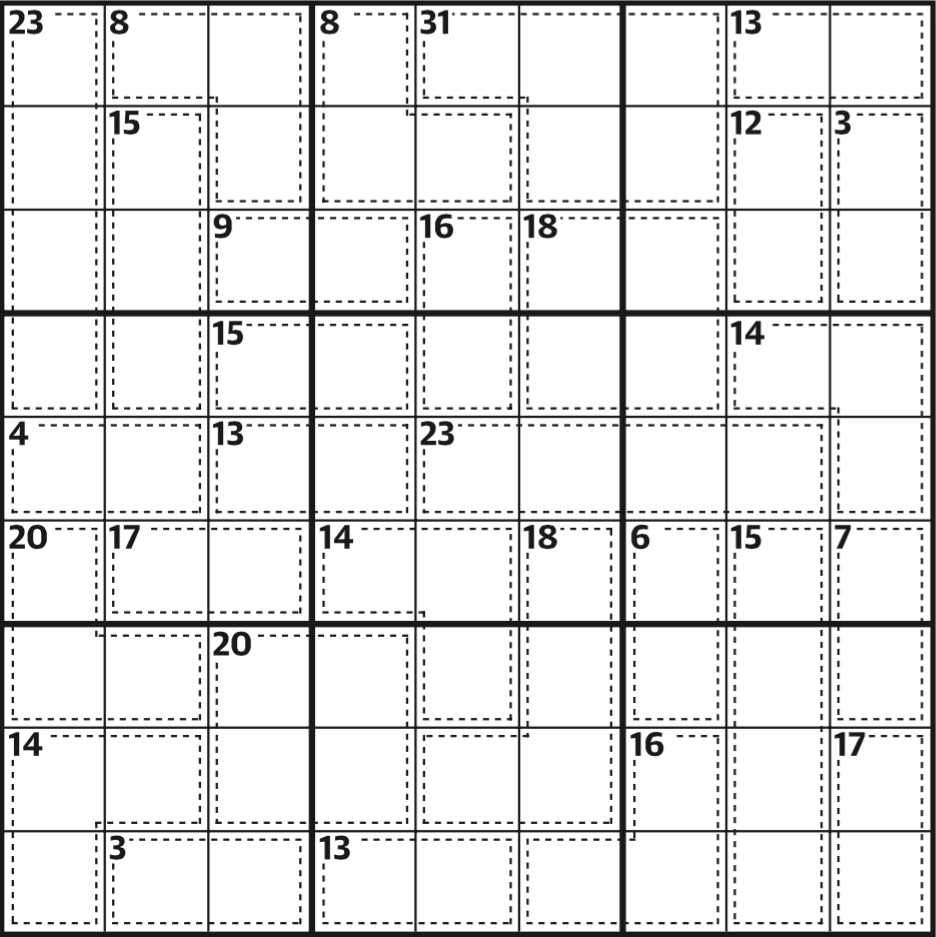
</p> 

Большой квадрат 9×9, малые 3х3. Поле заполняется цифрами от 1 до 9 так, чтобы ни одна цифра не повторялась ни по горизонтали, ни по вертикали, ни внутри квадрата из девяти клеток. При этом цифры объединены в группы и известна сумма цифр в этой группе.

### Термо-судоку

<p  align="center">
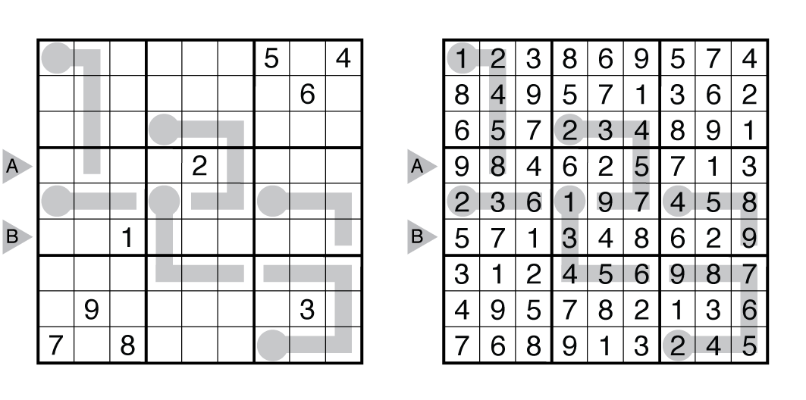
</p> 

Большой квадрат 9×9, малые 3х3. Правила заполения поля такие же, как и у классического судоку, за исклучением одной особенности — на сетке игрового поля располагаются "термометры". Цифры на термометрах должны увеличиваться по мере удаления от конца груши.

## Уровни сложности судоку на разных сайтах
## Наши судоку

При запуске пользователь видит меню, в котором можно выбрать два режима игры: классический судоку и судоку киллер. В данных играх есть возможность решать поля, а затем проверять их верность. Также можно выбрать игру по сидкоду.
### Реализованные методы

Самый простой реализован отчасти за счет того, что при удалении всех неподходящих элементов в множестве в итоге всегда остается одно число, которое соответствует решению в данной ячейке. Реализован методом ```deleteExtraValues()```.  
```python
    def deleteExtraValues(self):
        for i in range(self.totalNumber):
            for j in range(self.totalNumber):
                if len(self.numberField[i][j]) == 1:
                    for k in self.numberField[i][j]:
                        num = k
                    for chv in range(self.totalNumber):
                        self.numberField[i][chv].discard(num)
                        self.numberField[chv][j].discard(num)
                    self.numberField[i][j].add(num)
                    firstIndexRow = 3*(i//3) 
                    firstIndexColumn = 3*(j//3)
                    for chvr in range(3):
                        for chvc in range(3):
                            self.numberField[firstIndexRow+chvr][firstIndexColumn + chvc].discard(num)
                    self.numberField[i][j].add(num)
```

При нахождении ячейки, имеющей только одно значение, весь столбец, строка и блок проверяются и из возможных значений каждой проверяемой ячейки удаляется это число.  

Является самым легким методом решения в игре, с которого и начинается автоматическое прорешивание поля программой для установления уровня сложности.  

Метод ***"последний герой"*** реализован через ```singleCandidates()```.  

```python
    def singleCandidates(self): #name is taken from https://www.conceptispuzzles.com/ru/
        for j in range(self.totalNumber):                   #row
            for k in range(1, self.totalNumber+1):
                soughtNumber = k
                for i in range(self.totalNumber):
                    for cell in self.numberField[i][j]:
                        if cell == k:
                            soughtNumber = 0
                            break 
                if soughtNumber != 0:
                    placeCount = 0
                    for i in range(self.totalNumber):
                        if placeCount == 2:
                            break
                        if soughtNumber in self.numberField[i][j]:
                            placeCount += 1
                            indexSoughtRow = i
                    if placeCount == 1:
                        self.numberField[indexSoughtRow][j].clear()
                        self.numberField[indexSoughtRow][j].add(soughtNumber)
                        self.deleteExtraValues()
                        self.changes = True
                        self.isSingleCand = True
        for i in range(self.totalNumber):                    #column
            for k in range(1, self.totalNumber+1):
                soughtNumber = k
                for j in range(self.totalNumber):
                    for cell in self.numberField[i][j]:
                        if cell == k:
                            soughtNumber = 0
                            break 
                if soughtNumber != 0:
                    placeCount = 0
                    for j in range(self.totalNumber):
                        if placeCount == 2:
                            break
                        if soughtNumber in self.numberField[i][j]:
                            placeCount += 1
                            indexSoughtColumn = j
                    if placeCount == 1:
                        self.numberField[i][indexSoughtColumn].clear()
                        self.numberField[i][indexSoughtColumn].add(soughtNumber)
                        self.deleteExtraValues()
                        self.changes = True
                        self.isSingleCand = True
        for countBlock in range(self.totalNumber):          #block
            firstIndexRow = 3*(countBlock // 3)
            firstIndexColumn = 3*(countBlock % 3)
            for k in range(1, self.totalNumber+1):
                soughtNumber = k
                for i in range(3):
                    for j in range(3):
                        row = firstIndexRow+i
                        col = firstIndexColumn+j
                        for cell in self.numberField[row][col]:
                            if cell == k:
                                soughtNumber = 0
                                break 
                if soughtNumber != 0:
                    placeCount = 0
                    for i in range(3):
                        for j in range(3):
                            row = firstIndexRow+i
                            col = firstIndexColumn+j
                            if placeCount == 2:
                                break
                            if soughtNumber in self.numberField[row][col]:
                                placeCount += 1
                                indexSoughtColumn = col
                                indexSoughtRow = row
                    if placeCount == 1:
                        self.numberField[indexSoughtRow][indexSoughtColumn].clear()
                        self.numberField[indexSoughtRow][indexSoughtColumn].add(soughtNumber)
                        self.deleteExtraValues()
                        self.changes = True
                        self.isSingleCand = True
```

При проходе функции по столбцу, строке или блоке подсчитывается количество элементов, встречающихся в одной области, и если число в какой-то момент соответствует двойке, процесс прерывается, если в итоге число равно единице, то все остальные значения удаляются из ячейки и процедура возвращается к самому простому методу решения для удаления этого числа из всех ячеек областей, к которому оно относится.  

Для метода решения ***"Голые пары"*** реализуется метод ```nakedPairs()```. Основан на разности множеств. Если при вычитании множества A из множества B итоговое можество является пустым, и каждое из этих множеств содержит по 2 элемента, то они считаются "голой парой", и эти два числа вычитаются из остальных ячеек области, которая исследовалась.  
```python
    def nakedPairs(self):
        for i in range(self.totalNumber): 
            for j in range(self.totalNumber-1): 
                if len(self.numberField[i][j]) == 2:
                    matchingCells = {} 
                    matchingCells[j] = self.numberField[i][j]
                    for nextCol in range(j+1,self.totalNumber): 
                        if len(self.numberField[i][nextCol]) == 2 and self.numberField[i][nextCol] == self.numberField[i][j]:
                            matchingCells[nextCol] = self.numberField[i][nextCol]
                            for key in matchingCells.keys():
                                if key == j:
                                    continue
                            for col in range(self.totalNumber):
                                    if col != j and col != nextCol:
                                        changesControl = len(self.numberField[i][col])
                                        self.numberField[i][col].difference_update(matchingCells[j])
                                        if len(self.numberField[i][col]) != changesControl:
                                            self.deleteExtraValues()
                                            self.changes = True
                                            self.isNakedPairs = True
                            break
                if len(self.numberField[j][i]) == 2:
                    matchingCells = {} 
                    matchingCells[j] = self.numberField[j][i]
                    for nextRow in range(j+1,self.totalNumber): 
                        if len(self.numberField[nextRow][i]) == 2 and self.numberField[nextRow][i] == self.numberField[j][i]: 
                            matchingCells[nextRow] = self.numberField[nextRow][i]
                            for key in matchingCells.keys():
                                if key == j:
                                    continue
                                for row in range(self.totalNumber):
                                    if row != j and row != nextRow:
                                        changesControl = len(self.numberField[row][i])
                                        self.numberField[row][i].difference_update(matchingCells[j])
                                        if len(self.numberField[row][i]) != changesControl:
                                            self.deleteExtraValues()
                                            self.changes = True
                                            self.isNakedPairs = True
                            break
        for countBlock in range(self.totalNumber):
            fIndexRow = 3*(countBlock // 3)
            fIndexColumn = 3*(countBlock % 3)
            for index in range(self.totalNumber):
                if len(self.numberField[fIndexRow + (index // 3)][fIndexColumn + (index % 3)]) == 2:
                    matchingCells = {}
                    matchingCells[index] = self.numberField[fIndexRow + (index // 3)][fIndexColumn + (index % 3)]
                    for nextCell in range(index+1,self.totalNumber):
                        if len(self.numberField[fIndexRow + (nextCell // 3)][fIndexColumn + (nextCell % 3)]) == 2 and len(self.numberField[fIndexRow+nextCell // 3][fIndexColumn+nextCell % 3].difference(matchingCells[index])) == 0:
                            matchingCells[nextCell] = self.numberField[fIndexRow+nextCell // 3][fIndexColumn+nextCell % 3]
                            for key in matchingCells.keys():
                                if key == index:
                                    continue
                                for cell in range(self.totalNumber):
                                    if cell != index and cell != nextCell:
                                        changesControl = len(self.numberField[fIndexRow+cell // 3][fIndexColumn+cell % 3])
                                        self.numberField[fIndexRow+cell // 3][fIndexColumn+cell % 3].difference_update(matchingCells[index])
                                        if len(self.numberField[fIndexRow+cell // 3][fIndexColumn+cell % 3]) != changesControl:
                                            self.deleteExtraValues()
                                            self.changes = True
                                            self.isNakedPairs = True
                            break
```

После окончания процесса происходит возврат к ```deleteExtraValues().

Метод ***"Голые тройки"*** реализован частично на основе механики из метода "Голых пар" лишь с той разницей, что при разнице множеств допускается один избыточный элемент, вместо двух чисел ищется три, а также вместо проверки двух ячеек проверяются три. В каждой из трех ячеек должно находиться два или три числа из избранной тройки.

```python
    def nakedTreesome(self):
        for i in range(self.totalNumber):
            count = 0
            for j in range(self.totalNumber):
                if len(self.numberField[i][j]) > 1:
                    count +=1
            if count > 3:
                for j in range(self.totalNumber-1):
                    if len(self.numberField[i][j]) == 3:
                        matchingCells = {}
                        matchingCells[j] = self.numberField[i][j]
                        for nextCol in range(j+1, self.totalNumber):
                            if self.numberField[i][nextCol].difference(self.numberField[i][j]) == 0:
                                matchingCells[j] = self.numberField[i][nextCol]
                        if len(matchingCells) == 3:
                            for col in range(self.totalNumber):
                                if not col in matchingCells.keys():
                                    controlChanges = self.numberField[i][col]
                                    self.numberField[i][col].difference_update(matchingCells[j])
                                    if self.numberField[i][col] != changesControl:

                                        self.changes = True
                                        self.isNakedThreesome = True
```

Метод "Скрытые пары" также близок по своей идее с методом "Голых пар", но вместо разности используется пересечение множеств. Если при пересечении множеств возможных чисел двух ячеек одной области образуется множество с двумя элементами, то запускается процесс поиска в этой же области наличия хотя бы одного из чисел множества-пересечения в остальных, кроме уже взятых ранее двух, ячейках. При обнаружении их, процесс прерывается, если же ни одно число не было обнаружено, что в исходных двух ячейках удаляются все остальные значения кроме тех двух, что являются для них общими.

```python
    def hiddenPiars(self):
        for i in range(self.totalNumber): 
            for j in range(self.totalNumber-1): 
                if len(self.numberField[i][j]) > 1:
                    matchingCells = {} 
                    matchingCells[j] = self.numberField[i][j]
                    for nextCol in range(j+1, self.totalNumber):
                        intersect = self.numberField[i][j].intersection(self.numberField[i][nextCol])
                        if len(intersect) == 2:
                            for chAllCol in range(self.totalNumber):
                                if chAllCol == nextCol or chAllCol == j:
                                    continue
                                if len(self.numberField[i][chAllCol].intersection(intersect)) > 0:
                                    intersect.clear()
                                    break
                        if len(intersect) == 2:
                            matchingCells[nextCol] = self.numberField[i][nextCol]
                    if len(matchingCells) == 2 and len(intersect) == 2:
                        for k in matchingCells.keys():
                            changesControl = len(self.numberField[i][k])
                            self.numberField[i][k].intersection_update(intersect)
                            if len(self.numberField[i][k]) != changesControl:
                                self.deleteExtraValues()
                                self.changes = True
                                self.isHidPair = True
            for j in range(self.totalNumber-1): 
                if len(self.numberField[j][i]) > 1:
                    matchingCells = {} 
                    matchingCells[j] = self.numberField[j][i]
                    for nextRow in range(j+1, self.totalNumber):
                        intersect = self.numberField[j][i].intersection(self.numberField[nextRow][i])
                        if len(intersect) == 2:
                            for chAllRow in range(self.totalNumber):
                                if chAllRow == nextRow or chAllRow == j:
                                    continue
                                if len(self.numberField[chAllRow][i].intersection(intersect)) > 0:
                                    intersect.clear()
                                    break
                        if len(intersect) == 2:
                            matchingCells[nextRow] = self.numberField[nextRow][i]
                    if len(matchingCells) == 2 and len(intersect) == 2:
                        for k in matchingCells.keys():
                            changesControl = len(self.numberField[k][i])
                            self.numberField[k][i].intersection_update(intersect)
                            if len(self.numberField[k][i]) != changesControl:
                                self.deleteExtraValues()
                                self.changes = True
                                self.isHidPair = True                                                                 
        for countBlock in range(self.totalNumber):
            fIndexRow = 3*(countBlock // 3)
            fIndexColumn = 3*(countBlock % 3)
            for index in range(self.totalNumber):
                if len(self.numberField[fIndexRow + (index // 3)][fIndexColumn + (index % 3)]) > 1:
                    matchingCells = {}
                    matchingCells[index] = self.numberField[fIndexRow + (index // 3)][fIndexColumn + (index % 3)]
                    for nextCell in range(index+1,self.totalNumber):
                        intersect = self.numberField[fIndexRow + (index // 3)][fIndexColumn + (index % 3)].intersection(self.numberField[fIndexRow + (nextCell // 3)][fIndexColumn + (nextCell % 3)])
                        if len(intersect) == 2:
                            for chAllCell in range(self.totalNumber):
                                if chAllCell == nextCell or chAllCell == index:
                                    continue
                                if len(self.numberField[fIndexRow + (chAllCell // 3)][fIndexColumn + (chAllCell % 3)].intersection(intersect)) > 0:
                                    intersect.clear()
                                    break
                        if len(intersect) == 2:
                            matchingCells[nextCell] = self.numberField[fIndexRow + (nextCell // 3)][fIndexColumn + (nextCell % 3)]
                    if len(matchingCells) == 2 and len(intersect) == 2:
                        for k in matchingCells.keys():
                            changesControl = len(self.numberField[fIndexRow + (k // 3)][fIndexColumn + (k % 3)])
                            self.numberField[fIndexRow + (k // 3)][fIndexColumn + (k % 3)].intersection_update(intersect)
                            if len(self.numberField[fIndexRow + (k // 3)][fIndexColumn + (k % 3)]) != changesControl:
                                self.deleteExtraValues()
                                self.changes = True
                                self.isHidPair = True
```

Метод "Скрытые тройки" использует тактику двух предыдущих. Как и в "Скрытых парах", вместо разницы множеств используется их пересечения. Как и в "Голых тройках", благодаря созданию нового множества через пересечение, выбирается три числа, поиск которых происходит во всех остальных ячейках области. При обнаружении реализуется логика метода "Скрытые пары"

```python
    def hiddenTriples(self):
        for i in range(self.totalNumber): 
            for j in range(self.totalNumber-1):  
                if len(self.numberField[i][j]) > 1:
                    for nextCol in range(j+1, self.totalNumber):
                        commonNums = self.numberField[i][j].intersection(self.numberField[i][nextCol])
                        if len(commonNums) == 3:
                            matchingCells = {} 
                            matchingCells[j] = self.numberField[i][j]
                            matchingCells[nextCol] = self.numberField[i][nextCol]
                            for chAllCol in range(self.totalNumber):
                                if chAllCol == nextCol or chAllCol == j:
                                    continue
                                if len(self.numberField[i][chAllCol].intersection(commonNums)) == 1:
                                    commonNums.clear()
                                    break
                                if len(self.numberField[i][chAllCol].intersection(commonNums)) == 2 or len(self.numberField[i][chAllCol].intersection(commonNums)) == 3:
                                    matchingCells[chAllCol] = self.numberField[i][chAllCol]
                            if len(matchingCells) == 3 and len(commonNums) !=0:
                                for k in matchingCells.keys():
                                    changesControl = len(self.numberField[i][k])
                                    self.numberField[i][k].intersection_update(commonNums)
                                    if len(self.numberField[i][k]) != changesControl:
                                        self.deleteExtraValues()
                                        self.changes = True
                                        self.isHidPair = True
        for j in range(self.totalNumber-1):  
                if len(self.numberField[j][i]) > 1:
                    for nextRow in range(j+1, self.totalNumber):
                        commonNums = self.numberField[j][i].intersection(self.numberField[nextRow][i])
                        if len(commonNums) == 3:
                            matchingCells = {} 
                            matchingCells[j] = self.numberField[j][i]
                            matchingCells[nextRow] = self.numberField[nextRow][i]
                            for chAllRows in range(self.totalNumber):
                                if chAllRows == nextRow or chAllRows == j:
                                    continue
                                if len(self.numberField[chAllRows][i].intersection(commonNums)) == 1:
                                    commonNums.clear()
                                    break
                                if len(self.numberField[chAllRows][i].intersection(commonNums)) == 2 or len(self.numberField[chAllRows][i].intersection(commonNums)) == 3:
                                    matchingCells[chAllRows] = self.numberField[chAllRows][i]
                            if len(matchingCells) == 3 and len(commonNums) !=0:
                                for k in matchingCells.keys():
                                    changesControl = len(self.numberField[k][i])
                                    self.numberField[k][i].intersection_update(commonNums)
                                    if len(self.numberField[k][i]) != changesControl:
                                        self.deleteExtraValues()
                                        self.changes = True
                                        self.isHidPair = True
```

## Структура проекта  

|  Название файла           |      Описание    |
|---------------------------|------------------|
|parserTest/fieldParser.py  |Функции для парсинга игрового поля с сайта. |
|parserTest/testGen.py      |Тестирование подгружаемых полей с сайта sudoku.org.ua|
|parserTest/msedgedriver.exe|WebDriver для парсинга.  |
|parserTest/testFi.txt   |Множество подгруженных тестируемых полей. |
|parserTest/testGen.txt   |Множество протестированных полей. |
|picReadme  |Файл с картинками для файла README.md |
|generation.py  |Файл для генерации полей судоку. |
|sud.py  |Основной файл.  В нём создаётся главное меню и генерируется визуализация полей судоку.|
|solvingMethods.py  |Содержит класс с методами решения судоку для установления сложности и естественной генерации поля головоломки за счет решения программой генерируемого поля близкими человеку способами. |


